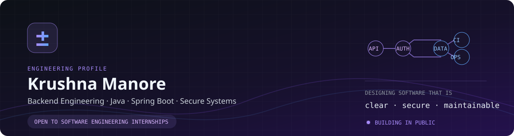
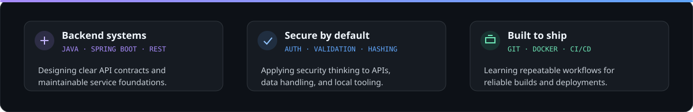
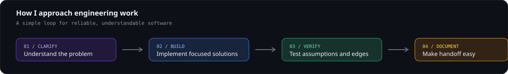
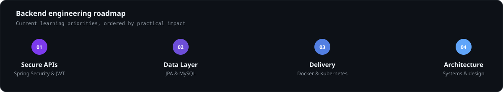

<div align="center">



<br />

[](https://github.com/krushna1845-lab)
[](mailto:krushna1845@gmail.com)
[](https://www.google.com/maps?q=Pune,+India)

</div>

<br />

## Professional Summary

I am a **Computer Engineering student at Indira College of Engineering and Management, Pune**, developing practical backend systems with **Java and Spring Boot**. I care about the engineering details that make software dependable: clear API contracts, maintainable code, relational data modelling, secure defaults, and repeatable delivery.

My current work combines Java backend development with hands-on security exploration. I am actively preparing for **Software Engineering Internships** and **Backend / Java development roles** where I can contribute, learn from strong engineering teams, and ship useful software.

| What I bring | Current focus |
| - | - |
| **Backend foundation** | Java, Spring Boot, REST APIs, JWT authentication, Maven |
| **Data & design** | MySQL, SQLite, relational modelling, API error handling |
| **Security mindset** | Authentication, input validation, hash-based detection, file monitoring |
| **Delivery mindset** | Docker, Kubernetes fundamentals, Git, CI/CD exploration |

<br />

<div align="center">



</div>

---

## Engineering Profile

<div align="center">


</div>

<br />

```text
NOW        Building Java backend depth through Spring Boot projects
NEXT       Applying Spring Security, Data JPA, Docker, and deployment practices
EXPLORING  Backend system design, microservices patterns, and cloud fundamentals
OPEN TO    Software Engineering Internships · Java / Backend development roles
```

---

## Technical Toolkit

<div align="center">


</div>

| Area | Tools & concepts |
| - | - |
| **Backend** | Java, Spring Boot, RESTful APIs, JWT, Maven |
| **Databases** | MySQL, SQLite, schema design, CRUD operations |
| **DevOps** | Docker, Kubernetes fundamentals, Git, GitHub Actions |
| **Security** | Authentication, validation, hashing, file monitoring |
| **Applied Python** | PySide6, Watchdog, psutil, OpenCV |
| **Core engineering** | OOP, DSA, debugging, system-design fundamentals |

---

## Featured Work

<table>
  <tr>
    <td width="50%" valign="top">
      <h3>🛡️ MidBrain Antivirus</h3>
      <p>An educational desktop security project that explores hash-based malware detection, real-time file monitoring, junk-file cleanup, RAM optimisation, and local threat handling through a PySide6 interface.</p>
      <p><b>Python · PySide6 · Watchdog · psutil · hashlib</b></p>
      <a href="https://github.com/krushna1845-lab/MidBrain_Antivirus">View repository →</a>
    </td>
    <td width="50%" valign="top">
      <h3>☕ Core Java</h3>
      <p>A focused Java practice repository supporting continued development of language fundamentals, object-oriented thinking, and clean problem-solving habits.</p>
      <p><b>Java · OOP · Core language fundamentals</b></p>
      <a href="https://github.com/krushna1845-lab/Core-Java">View repository →</a>
    </td>
  </tr>
  <tr>
    <td width="50%" valign="top">
      <h3>🚀 Java Backend Journey</h3>
      <p>An ongoing learning repository documenting the path from Java fundamentals to production-oriented backend development.</p>
      <p><b>Java · Backend learning · Engineering practice</b></p>
      <a href="https://github.com/krushna1845-lab/java-backend-journey">View repository →</a>
    </td>
    <td width="50%" valign="top">
      <h3>🔐 In Development</h3>
      <p>JWT Authentication System and E-Commerce Backend are currently being built. They will be added here once their source, documentation, and setup instructions are public.</p>
      <p><b>Spring Boot · MySQL · REST APIs · JWT</b></p>
      <a href="#current-learning-roadmap">Follow the roadmap →</a>
    </td>
  </tr>
</table>

---

## Working Style

<div align="center">



</div>

---

## Current Learning Roadmap

<a id="current-learning-roadmap"></a>

<div align="center">



</div>

<br />

| Priority | Focus | Outcome |
| :-: | - | - |
| 01 | Spring Security & JWT | Secure APIs with sound authentication and authorization flows |
| 02 | Spring Data JPA & MySQL | Clean persistence layers and reliable relational models |
| 03 | Docker & Kubernetes | Portable local environments and deployment fundamentals |
| 04 | DSA & system design | Stronger problem solving and scalable backend reasoning |
| 05 | Testing & observability | Better confidence through JUnit, structured errors, and Actuator exploration |

---

## Education & Learning Credentials

| Credential | Detail |
| - | - |
| **B.Tech — Computer Engineering** | Indira College of Engineering and Management, Pune |
| **Diploma — Computer Engineering** | Guru Gobind Singh Polytechnic, 2022–2025 |
| **J.P. Morgan** | Job simulation / certification program |
| **Google MLCC** | Machine Learning Crash Course completion |
| **Generative AI** | Dedicated fundamentals and applied-use-cases course |

---

## Contribution Activity

<div align="center">



</div>

---

## Principles I Work By

> **Make the next engineer successful.** I value clear naming, small focused changes, useful documentation, safe defaults, and code that is straightforward to test and maintain.

<div align="center">

### Let’s build dependable software.

[](mailto:krushna1845@gmail.com)

</div>
